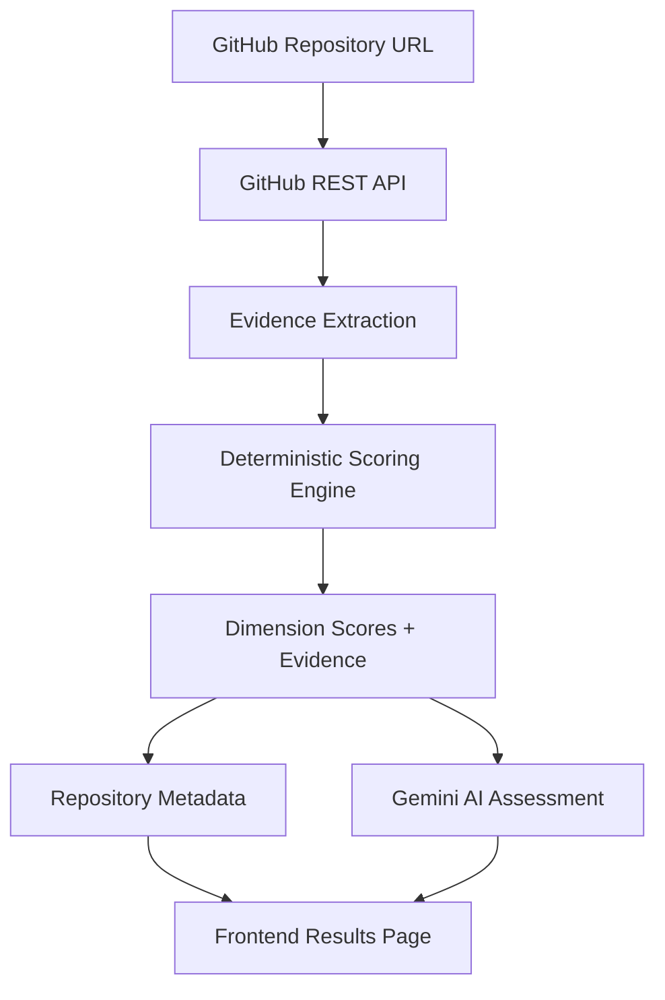

# GitGrade

**Evaluate any public GitHub repository with transparent, evidence-based scoring — powered by deterministic rules, explained by AI.**


---
🌐 **Live Demo:** https://gitgrade-lilac.vercel.app/

Try any public GitHub repository and receive an evidence-based evaluation in seconds.

## Overview

GitGrade evaluates public GitHub repositories across key quality dimensions and produces a structured score — without relying on AI to decide what "good" looks like.

The scoring engine works entirely from observable repository evidence: files present, structure, documentation signals, and configuration choices. Once scoring is complete, Gemini generates a human-readable assessment from those results.

**The separation is intentional.** Scores are deterministic and traceable. AI is limited to communication, not evaluation.

---

## Why GitGrade?

Most AI-powered repository evaluators ask a language model to read a repo and rate it. The problem: there's no guarantee the model applies consistent criteria, and the score can't be audited or traced.

GitGrade takes a different approach:

- **Every score maps to observable evidence.** A dimension scores well because specific signals were detected — not because a model had a positive impression.
- **Deterministic scoring is explainable.** You can look at any score and understand exactly what contributed to it.
- **AI is used to communicate insights from the evidence, while evaluation criteria remain deterministic and transparent.** Gemini generates readable summaries and recommendations, but it never generates or modifies a score.
- **Metadata is not scoring.** Metrics like commit count, repo age, and last activity provide context. They are displayed separately because "measurable" doesn't automatically mean "score-worthy" — penalising a well-documented, well-structured repo because it was created recently would be unfair.

This architecture keeps the evaluation transparent, consistent, and trustworthy.

---

## Features

- 🔍 **URL-based evaluation** — paste any public GitHub repository URL and get a report instantly
- 📊 **Deterministic scoring** — rules-based engine with no AI involvement in the scoring calculation
- 🤖 **AI assessment layer** — Gemini generates a written summary, highlights, and recommendations from the computed scores
- 🧾 **Repository metadata** — contextual signals displayed separately from the score
- ⚡ **Graceful degradation** — if the AI layer is unavailable, scores and evidence are still returned
- 🔗 **Shareable results** — every report lives at a stable URL (`/results/[owner]/[repo]`)

---

## Evaluation Rubric

GitGrade scores repositories across three dimensions. Each dimension is computed from a set of binary evidence signals detected via the GitHub API.

| Dimension | Weight | What It Evaluates |
|---|---|---|
| **Documentation** | 30% | Presence and quality of README, installation guide, usage examples, visuals, live demo link |
| **Project Structure** | 35% | `.gitignore`, dependency file, organised folder layout, absence of committed build artifacts |
| **Project Completeness** | 35% | License, deployment configuration, environment setup documentation, additional project docs |

### Signals Breakdown

<details>
<summary><strong>📝 Documentation (30%)</strong></summary>

| Signal | Description |
|---|---|
| README present | A README file exists at the repository root |
| Detailed README | README contains substantial content (not a stub) |
| Installation guide | Instructions for setting up the project locally |
| Usage examples | Examples demonstrating how to use the project |
| Technologies listed | Tech stack is documented |
| Visual preview | Screenshots, GIFs, or diagrams included |
| Live demo link | A deployed version is linked from the README |

</details>

<details>
<summary><strong>📁 Project Structure (35%)</strong></summary>

| Signal | Description |
|---|---|
| `.gitignore` present | Repository includes a `.gitignore` file |
| Dependency file present | `package.json`, `requirements.txt`, `Cargo.toml`, etc. detected |
| Organised folder structure | Source files are grouped logically (not all at root) |
| No build artifacts committed | `node_modules`, `dist`, `build`, `__pycache__` etc. absent from repository |

</details>

<details>
<summary><strong>✅ Project Completeness (35%)</strong></summary>

| Signal | Description |
|---|---|
| License present | A recognised open-source license file exists |
| Deployment configured | Deployment-related files or references detected |
| Environment setup documented | `.env.example` or equivalent is present |
| Additional documentation | Docs beyond the root README (wikis, `/docs` folder, etc.) |

</details>

---

## Repository Metadata

GitGrade surfaces the following metadata alongside the score report. These signals are **intentionally excluded from scoring**.

| Metadata | Why It's Not Scored |
|---|---|
| Repository age | A well-structured new repo shouldn't be penalised |
| Last updated | Inactivity can be intentional (completed projects) |
| Commit count | Volume of commits doesn't reflect quality |
| Meaningful commit ratio | Useful context, but hard to normalise fairly |
| Contributors | Solo projects shouldn't score lower than team projects |
| Primary language | Language choice has no bearing on quality |

These metrics provide useful context for a recruiter or reviewer, without introducing unfair bias into the score.

---

## Design Philosophy

> **AI should explain repository quality, not decide it.**

This constraint shapes every layer of GitGrade's architecture.

**Deterministic scoring** means the evaluation engine has no probabilistic components. Given the same repository, the score will always be the same. This makes the system auditable — you can point to a specific signal and explain exactly why a score changed.

**AI as an interpretation layer** means Gemini receives the computed scores and evidence as structured input, then generates written summaries and recommendations from them. The model is explicitly instructed not to generate or modify scores. If the AI layer fails, GitGrade degrades gracefully to returning scores and evidence only.

**Metadata separation** is a deliberate product decision. A repository can have high commit frequency and still be poorly documented. A repo can be two weeks old and demonstrate strong project structure. Conflating activity signals with quality signals produces misleading scores.

The result is an evaluation tool where every output is traceable, every score is reproducible, and AI adds communication value without introducing opacity.

---

## Architecture



**Request flow:**

1. User submits a repository URL via the frontend
2. FastAPI backend fetches repository data from the GitHub REST API in parallel
3. Evidence extraction checks for the presence of specific signals per dimension
4. The deterministic scoring engine computes dimension scores and an overall score from the evidence
5. Repository metadata is extracted separately and never fed into scoring
6. Computed scores and evidence are passed to Gemini, which generates a written assessment
7. The complete result (scores, evidence, metadata, AI assessment) is returned to the frontend

---

## Screenshots

> _Screenshots coming soon._

| Landing Page | Results Page |
|---|---|
| _(placeholder)_ | _(placeholder)_ |

---

## Running Locally

### Prerequisites

- Node.js 18+
- Python 3.10+
- GitHub personal access token
- Google Gemini API key

### Frontend

```bash
git clone https://github.com/tripti-inlayers/gitgrade.git
cd gitgrade/frontend

npm install
npm run dev
```

### Backend

```bash
cd gitgrade/backend

python -m venv venv
source venv/bin/activate  # Windows: venv\Scripts\activate

pip install -r requirements.txt
uvicorn main:app --reload
```

---

## Environment Variables

### Backend (`/backend/.env`)

```env
GITHUB_TOKEN=your_github_personal_access_token
GEMINI_API_KEY=your_gemini_api_key
```

### Frontend (`/frontend/.env.local`)

```env
NEXT_PUBLIC_API_URL=http://localhost:8000
```

---

## Project Structure

```
gitgrade/
├── frontend/               # Next.js 15 App Router
│   ├── app/
│   │   ├── page.jsx        # Landing page
│   │   └── results/
│   │       └── [owner]/
│   │           └── [repo]/
│   │               ├── page.jsx      # Results Server Component
│   │               ├── loading.jsx   # Suspense fallback
│   │               └── error.jsx     # Error boundary
│   └── components/
│       └── DimensionCard.jsx
│
├── backend/                # FastAPI
│   ├── main.py             # API entry point
│   ├── github_client.py    # GitHub API integration
│   ├── scoring_engine.py   # Deterministic scoring logic
│   ├── ai_analyzer.py      # Gemini assessment layer
│   └── requirements.txt
│
└── README.md
```

---

## Known Limitations

**Deployment detection** currently relies on repository-level evidence — deployment-related files and links in the README. A repository may be actively deployed but score lower on this signal if the deployment is not documented within the repository itself.

A future improvement is to integrate the [GitHub Deployments API](https://docs.github.com/en/rest/deployments) and detect GitHub Pages, which would surface deployment status independently of what's written in the README.

---

## Future Roadmap

- [ ] GitHub Deployments API integration for accurate deployment detection
- [ ] GitHub Pages detection
- [ ] Inline metric explanations (toggle-based, mobile-compatible)
- [ ] Repository comparison (side-by-side scoring)
- [ ] Downloadable PDF reports
- [ ] Custom scoring profiles (e.g. weighted for open-source vs. portfolio projects)
- [ ] Improved README semantic analysis

---

## Contributing

Contributions are welcome. Please open an issue before submitting a pull request to discuss the proposed change.

```bash
# Fork the repository, then:
git checkout -b feature/your-feature-name
git commit -m "add: description of change"
git push origin feature/your-feature-name
# Open a pull request
```

---

## License

MIT — see [LICENSE](./LICENSE) for details.
